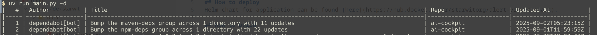

# List Pull Requests
Creates a list of open pull requests in an organisation.

If your orga contains private repos, you have to create an .env file containing an access token.

## Example usage
Following command gets all PRs from organization starwit, that were opened by Dependabot:
```bash
uv run main.py -d -o starwit
```

Output looks like this.

